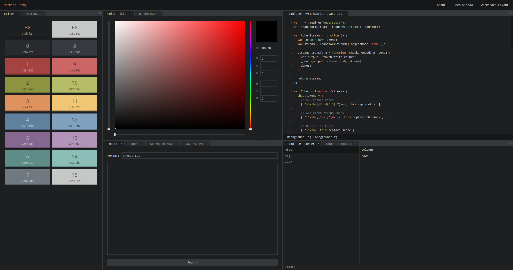

SvelteKit
TypeScript
Vitest 
satellite.js
celestrak > https://celestrak.org/NORAD/documentation/

Playwright > optional
Cloudflare > optional later

CLI interface allowing for real time satellite monitoring powered by CelesTrak and SGP4.

Feature list:
- CLI interface
- threading
- Commands (lexing + parsing)
    - help
    - clear
    - watch <group|catnr>


TODO:
- commands: 
    - thread <id>
    - cleanup --type (instead of just --e)
    - stats
    - top

    satellite
    - ping <url>
    - fetch <url>
    - bench
        
- First SGP4
- fix any[] in satelliteData
- refactor console/+page.svelte into smaller role specific systems.
- put more stuff in types.ts (global instead of sometimes redefine, bad mistake on my part..)
- better error handling
- fully make execute async (instead of semi as current)

Things to research/look at:
- windows/ os system
- DAG (directed acyclic graph)/ execution graph
- message bus


Color scheme:
Black: #161719

Option_highlighted: #35393C
Option_selected_not_highlighted: #161719

input	user command
info	system messages (“loading…”)
output	real computed results
highlight	banners, identity, key visual text
success	command completed
warning	non-fatal issues
alert	errors
debug	dev-only noise
notification	passive system events

{
  "name": "",
  "author": "",
  "color": [
    "#282a2e",
    "#a54242",
    "#8c9440",
    "#de935f",
    "#5f819d",
    "#85678f",
    "#5e8d87",
    "#707880",
    "#373b41",
    "#cc6666",
    "#b5bd68",
    "#f0c674",
    "#81a2be",
    "#b294bb",
    "#8abeb7",
    "#c5c8c6"
  ],
  "foreground": "#c5c8c6",
  "background": "#1d1f21",
  "blackHighlight": "#161719"
}


Font family: Droid Sans Mono

Design inspiration:




# Commands
This section defines the **CLI grammar, syntax conventions, and MVP command registry**.

## General Syntax
```bash
<namespace> [subcommand] [args] [--flags]
```

### Examples
```bash
help
clear
sat track iss
sat tle weather --limit 10
sat track iss --live --interval 1000
```

---

## Parsing Rules
- Split by whitespace **unless inside quotes**
- Support:
  - `"double quoted strings"`
  - `'single quoted strings'`
- Boolean flags:
  ```bash
  --live
  --json
  ```
- Key-value flags:
  ```bash
  --limit 10
  --group stations
  --interval 1000
  ```
- Unknown commands return:
  ```bash
  Unknown command "<name>". Type "help" to see available commands.
  ```

---

# Command Registry

## `help`
Displays available commands.

### Syntax
```bash
help [command]
```

### Examples
```bash
help
help sat
```

---

## `clear`
Clears terminal history and prompt output.

### Syntax
```bash
clear
```

---

## `history`
Displays cached command history.

### Syntax
```bash
history [--limit 20]
```

### Flags
- `--limit <n>` → max history rows returned

---

## `theme`
Switches terminal theme.

### Syntax
```bash
theme <name>
```

### Examples
```bash
theme dark
theme nord
```

---

## `echo`
Prints text directly to output.

### Syntax
```bash
echo <text>
```

### Example
```bash
echo "Tracking ISS..."
```

---

```bash
sat nearby <lat> <lon> --radius 200 --window 2
```

## `sat`
Primary satellite command namespace.

---

### `sat tle`
Fetches TLE data from CelesTrak.

#### Syntax
```bash
sat tle <query> [--limit 10]
```

#### Examples
```bash
sat tle iss
sat tle starlink --limit 5
```

#### Output
- NORAD ID
- object name
- line1
- line2

---

### `sat track`
Propagates real-time satellite position via SGP4.

#### Syntax
```bash
sat track <name|norad>
```

#### Examples
```bash
sat track iss
sat track 25544
```

#### Output
- latitude
- longitude
- altitude
- velocity
- timestamp

---

### `sat pass`
Predicts next observer-visible pass.

#### Syntax
```bash
sat pass <name|norad> --lat <v> --lon <v>
```

#### Example
```bash
sat pass iss --lat 52.09 --lon 5.12
```

---

## `watch`
Runs a command repeatedly in real time.

### Syntax
```bash
watch <satellite> [--interval 1000]
```

### Examples
```bash
watch iss
watch 25544 --interval 500
```

---